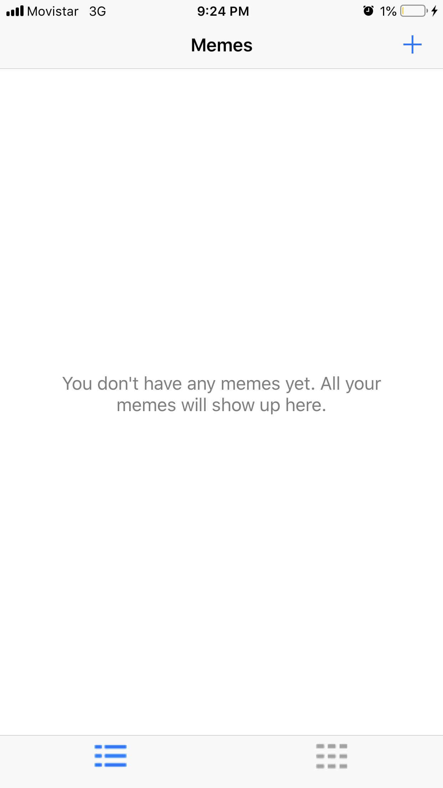
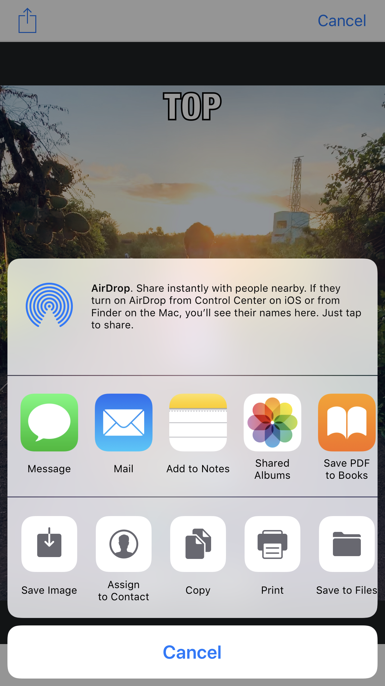
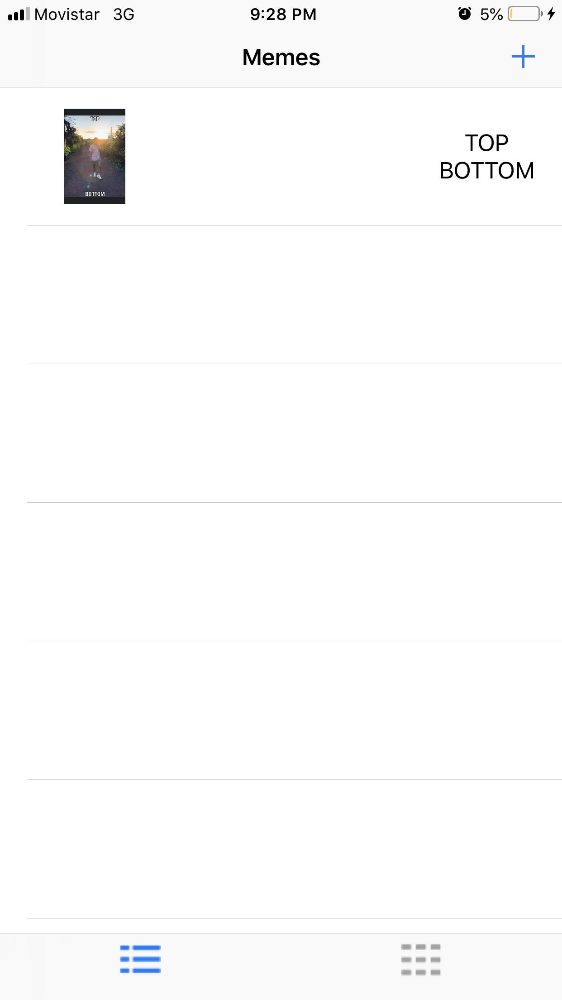

# MemeMe 2.0

A meme-generating app in Swift that enables users to attach a caption to a picture and presents them with several options for sharing the meme. The app also temporarily stores memes which users can browse in a table or a grid.
